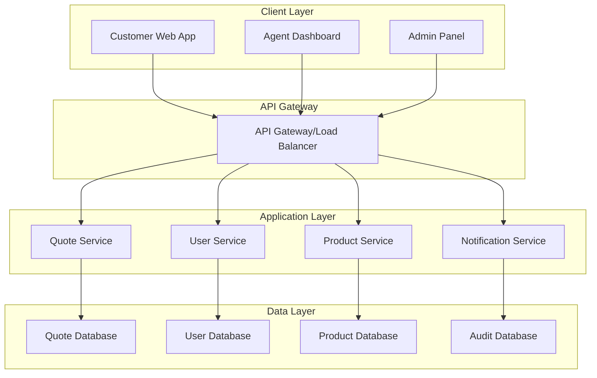

# Insurance Quotation Application Design

## Overview

The insurance quotation application is a web-based system that provides instant insurance quotes to customers while enabling agents and administrators to manage the quotation process. The system follows a microservices architecture with clear separation between the customer-facing quote engine, agent management interface, and administrative configuration system.

## Architecture

The application uses a layered architecture with the following components:



## Components and Interfaces

### 1. Quote Service
**Responsibilities:**
- Process quote requests and calculate premiums
- Apply risk assessment algorithms
- Generate and store quotes
- Manage quote lifecycle and expiration

**Key Interfaces:**
- `POST /api/quotes` - Create new quote
- `GET /api/quotes/{id}` - Retrieve quote by ID
- `PUT /api/quotes/{id}/status` - Update quote status
- `GET /api/quotes/search` - Search quotes with filters

### 2. User Service
**Responsibilities:**
- Manage customer and agent authentication
- Store and validate user profiles
- Handle user sessions and permissions

**Key Interfaces:**
- `POST /api/users/register` - Register new user
- `POST /api/users/login` - User authentication
- `GET /api/users/profile` - Get user profile
- `PUT /api/users/profile` - Update user profile

### 3. Product Service
**Responsibilities:**
- Manage insurance products and coverage options
- Store and retrieve pricing rules
- Handle product configuration changes

**Key Interfaces:**
- `GET /api/products` - List available products
- `GET /api/products/{id}/coverage` - Get coverage options
- `POST /api/products` - Create new product (admin)
- `PUT /api/products/{id}/pricing` - Update pricing rules (admin)

### 4. Notification Service
**Responsibilities:**
- Send email notifications for quotes
- Handle system alerts and notifications
- Manage notification templates

**Key Interfaces:**
- `POST /api/notifications/email` - Send email notification
- `GET /api/notifications/templates` - Get notification templates
- `POST /api/notifications/templates` - Create notification template

## Data Models

### Quote Model
```typescript
interface Quote {
  id: string;
  referenceNumber: string;
  customerId: string;
  productType: InsuranceType;
  personalInfo: PersonalInfo;
  coverageDetails: CoverageDetails;
  riskAssessment: RiskAssessment;
  premium: PremiumCalculation;
  status: QuoteStatus;
  expirationDate: Date;
  createdAt: Date;
  updatedAt: Date;
}

interface PersonalInfo {
  firstName: string;
  lastName: string;
  dateOfBirth: Date;
  address: Address;
  contactInfo: ContactInfo;
}

interface CoverageDetails {
  coverageType: string;
  coverageAmount: number;
  deductible: number;
  additionalOptions: string[];
}

interface RiskAssessment {
  riskScore: number;
  riskFactors: RiskFactor[];
  adjustments: PremiumAdjustment[];
}

interface PremiumCalculation {
  basePremium: number;
  adjustments: number;
  discounts: number;
  finalPremium: number;
  breakdown: PremiumBreakdown[];
}
```

### User Model
```typescript
interface User {
  id: string;
  email: string;
  role: UserRole;
  profile: UserProfile;
  createdAt: Date;
  lastLoginAt: Date;
}

interface UserProfile {
  firstName: string;
  lastName: string;
  phone?: string;
  preferences: UserPreferences;
}

enum UserRole {
  CUSTOMER = 'customer',
  AGENT = 'agent',
  ADMIN = 'admin'
}
```

### Product Model
```typescript
interface InsuranceProduct {
  id: string;
  name: string;
  type: InsuranceType;
  description: string;
  coverageOptions: CoverageOption[];
  pricingRules: PricingRule[];
  riskFactors: RiskFactorDefinition[];
  isActive: boolean;
}

interface PricingRule {
  id: string;
  condition: string;
  adjustment: number;
  adjustmentType: 'percentage' | 'fixed';
  priority: number;
}
```

## Error Handling

### Error Response Format
```typescript
interface ErrorResponse {
  error: {
    code: string;
    message: string;
    details?: any;
    timestamp: string;
    requestId: string;
  };
}
```

### Error Categories
1. **Validation Errors (400)**: Invalid input data, missing required fields
2. **Authentication Errors (401)**: Invalid credentials, expired tokens
3. **Authorization Errors (403)**: Insufficient permissions
4. **Not Found Errors (404)**: Resource not found
5. **Business Logic Errors (422)**: Quote calculation failures, risk assessment issues
6. **Server Errors (500)**: Database connection issues, external service failures

### Error Handling Strategy
- All API endpoints return consistent error response format
- Client-side validation for immediate feedback
- Server-side validation for security and data integrity
- Graceful degradation for non-critical features
- Comprehensive logging for debugging and monitoring

## Testing Strategy

### Unit Testing
- Test individual components and functions in isolation
- Mock external dependencies and database calls
- Focus on business logic, calculations, and validation rules
- Target 90%+ code coverage for critical paths

### Integration Testing
- Test API endpoints with real database connections
- Verify service-to-service communication
- Test authentication and authorization flows
- Validate data persistence and retrieval

### End-to-End Testing
- Test complete user workflows from UI to database
- Verify quote generation process end-to-end
- Test agent and admin workflows
- Validate email notifications and external integrations

### Performance Testing
- Load testing for concurrent quote requests
- Database query optimization validation
- API response time benchmarking
- Memory and resource usage monitoring

### Security Testing
- Input validation and SQL injection prevention
- Authentication and session management testing
- Data encryption verification
- Access control and permission testing

### Test Data Management
- Use test databases with realistic but anonymized data
- Implement data seeding for consistent test scenarios
- Clean up test data after test execution
- Maintain separate test environments for different testing phases