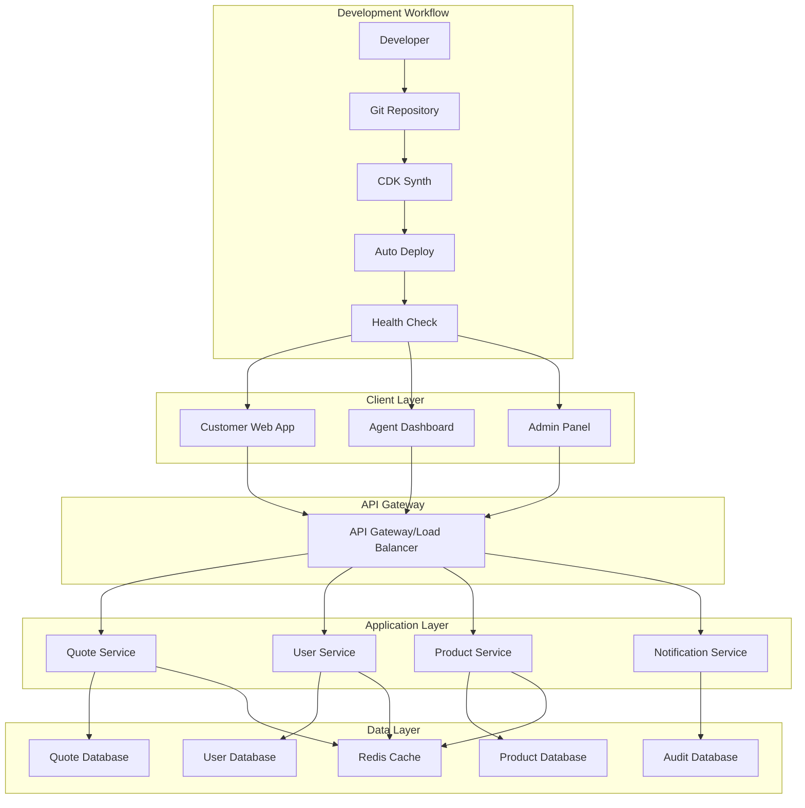
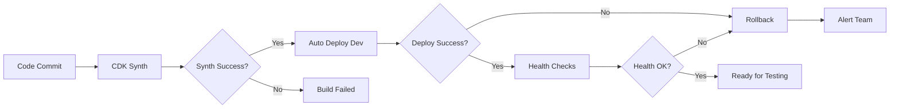

# Insurance Quotation Application Design

## Overview

The insurance quotation application is a web-based system that provides instant insurance quotes to customers while enabling agents and administrators to manage the quotation process. The system follows a microservices architecture with clear separation between the customer-facing quote engine, agent management interface, and administrative configuration system.

## Architecture

The application uses a layered architecture with automated deployment pipeline:

### Deployment Architecture

The system follows a clear separation between infrastructure and application deployments:

#### Infrastructure Deployment (CLI-based)
**Deployed via:** `cdk deploy` from local CLI or infrastructure CI/CD
**Components:**
- **VPC & Networking**: Private subnets, security groups, NAT gateways
- **Database Infrastructure**: Aurora Serverless PostgreSQL cluster
- **Cache Infrastructure**: ElastiCache Serverless Redis
- **Lambda Layer**: Shared dependencies (AWS SDK, ioredis, pg, uuid, joi)
- **SNS Topics**: Notification infrastructure for alerts
- **API Gateway Shell**: Base API Gateway without routes/methods

#### Application Deployment (Pipeline-based)
**Deployed via:** CodePipeline triggered by Git commits
**Components:**
- **Lambda Functions**: All business logic functions (quotes, users, products, health)
- **API Gateway Routes**: All endpoints and methods (/api/v1/*)
- **CloudWatch Alarms**: Application-specific monitoring and alerting
- **Application Configuration**: Environment variables, permissions

#### Deployment Boundary Logic
- **Infrastructure**: Foundational components that applications depend on
- **Application**: Business logic, API endpoints, and application-specific monitoring
- **Shared Dependencies**: Lambda layer provides consistent dependency versions across all functions
- **Monitoring**: Infrastructure provides notification channels, application provides specific alarms



## Components and Interfaces

### Deployment Component Mapping

**Infrastructure Components (CLI Deployment):**
- VPC, Database, Redis constructs → `infrastructure/constructs/`
- Lambda Layer → `layers/shared-dependencies/`
- SNS Topics → Infrastructure stack

**Application Components (Pipeline Deployment):**
- All Lambda functions → `src/lambda/`
- API Gateway routes → Serverless app construct
- CloudWatch alarms → Application monitoring
- Health check system → Application endpoint

### 1. Quote Service
**Responsibilities:**
- Process quote requests and calculate premiums
- Apply risk assessment algorithms
- Generate and store quotes
- Manage quote lifecycle and expiration

**Key Interfaces:**
- `POST /api/quotes` - Create new quote
- `GET /api/quotes/{id}` - Retrieve quote by ID
- `PUT /api/quotes/{id}/status` - Update quote status
- `GET /api/quotes/search` - Search quotes with filters

### 2. User Service
**Responsibilities:**
- Manage customer and agent authentication
- Store and validate user profiles
- Handle user sessions and permissions

**Key Interfaces:**
- `POST /api/users/register` - Register new user
- `POST /api/users/login` - User authentication
- `GET /api/users/profile` - Get user profile
- `PUT /api/users/profile` - Update user profile

### 3. Product Service
**Responsibilities:**
- Manage insurance products and coverage options
- Store and retrieve pricing rules
- Handle product configuration changes

**Key Interfaces:**
- `GET /api/products` - List available products
- `GET /api/products/{id}/coverage` - Get coverage options
- `POST /api/products` - Create new product (admin)
- `PUT /api/products/{id}/pricing` - Update pricing rules (admin)

### 4. Notification Service
**Responsibilities:**
- Send email notifications for quotes
- Handle system alerts and notifications
- Manage notification templates

**Key Interfaces:**
- `POST /api/notifications/email` - Send email notification
- `GET /api/notifications/templates` - Get notification templates
- `POST /api/notifications/templates` - Create notification template

### 5. Caching Layer
**Responsibilities:**
- Cache frequently accessed data (product information, pricing rules)
- Store temporary session data and rate limiting counters
- Improve API response times and reduce database load

**Implementation:**
- **ElastiCache Serverless Redis**: Auto-scaling cache with performance optimization
- **Connection Management**: Secure connection pooling with AWS Secrets Manager
- **Cache Strategies**: TTL-based expiration, cache-aside pattern
- **Key Prefixing**: Environment-specific key prefixes for isolation
- **Health Monitoring**: Built-in health checks for cache connectivity

### 6. Serverless Application Layer
**Responsibilities:**
- API Gateway with comprehensive security and CORS configuration
- Lambda functions with VPC integration and shared dependencies
- Environment-specific configurations and resource management
- Health monitoring and observability

**Implementation:**
- **API Gateway**: RESTful endpoints with IP-based access restrictions for production
- **Lambda Layers**: Simplified shared dependencies without Docker bundling for faster deployments
- **IAM Policies**: Least-privilege access to database, Redis, and VPC resources
- **CloudWatch Logs**: Environment-specific retention policies (1 week dev, 1 month prod)
- **Health Endpoints**: Built-in connectivity checks for all infrastructure components

**Lambda Layer Strategy:**
- **Pre-built Structure**: Use standard Node.js layer format (`nodejs/node_modules/`) without Docker
- **Build Script**: Simple npm install process to prepare layer dependencies
- **Automated CDK Bundling**: Uses CDK's built-in Docker bundling for consistent layer creation
- **Shared Dependencies**: Common AWS SDK clients, database drivers, and validation libraries

**Layer Implementation Details:**
```
layers/shared-dependencies/
├── package.json                 # Layer dependencies definition
└── (generated during deployment)
    └── nodejs/                 # Lambda layer runtime directory (auto-created)
        └── node_modules/       # Installed dependencies (auto-created)
            ├── @aws-sdk/
            ├── ioredis/
            ├── pg/
            ├── joi/
            └── uuid/
```

**Build Process:**
1. **CDK Bundling**: CDK automatically handles Docker-based bundling during deployment
2. **Dependency Installation**: Runs `npm ci --omit=dev --ignore-scripts` in Docker container
3. **Structure Creation**: Automatically creates `nodejs/node_modules/` structure
4. **Asset Optimization**: Removes unnecessary files (package.json, etc.) from final layer

**Benefits:**
- **Consistent Builds**: Docker ensures identical layer creation across environments
- **Automated Process**: No manual layer preparation required
- **Optimized Size**: Removes dev dependencies and unnecessary files automatically
- **CDK Integration**: Seamless integration with CDK deployment process

## Data Models

### Quote Model
```typescript
interface Quote {
  id: string;
  referenceNumber: string;
  customerId: string;
  productType: InsuranceType;
  personalInfo: PersonalInfo;
  coverageDetails: CoverageDetails;
  riskAssessment: RiskAssessment;
  premium: PremiumCalculation;
  status: QuoteStatus;
  expirationDate: Date;
  createdAt: Date;
  updatedAt: Date;
}

interface PersonalInfo {
  firstName: string;
  lastName: string;
  dateOfBirth: Date;
  address: Address;
  contactInfo: ContactInfo;
}

interface CoverageDetails {
  coverageType: string;
  coverageAmount: number;
  deductible: number;
  additionalOptions: string[];
}

interface RiskAssessment {
  riskScore: number;
  riskFactors: RiskFactor[];
  adjustments: PremiumAdjustment[];
}

interface PremiumCalculation {
  basePremium: number;
  adjustments: number;
  discounts: number;
  finalPremium: number;
  breakdown: PremiumBreakdown[];
}
```

### User Model
```typescript
interface User {
  id: string;
  email: string;
  role: UserRole;
  profile: UserProfile;
  createdAt: Date;
  lastLoginAt: Date;
}

interface UserProfile {
  firstName: string;
  lastName: string;
  phone?: string;
  preferences: UserPreferences;
}

enum UserRole {
  CUSTOMER = 'customer',
  AGENT = 'agent',
  ADMIN = 'admin'
}
```

### Product Model
```typescript
interface InsuranceProduct {
  id: string;
  name: string;
  type: InsuranceType;
  description: string;
  coverageOptions: CoverageOption[];
  pricingRules: PricingRule[];
  riskFactors: RiskFactorDefinition[];
  isActive: boolean;
}

interface PricingRule {
  id: string;
  condition: string;
  adjustment: number;
  adjustmentType: 'percentage' | 'fixed';
  priority: number;
}
```

## Error Handling

### Error Response Format
```typescript
interface ErrorResponse {
  error: {
    code: string;
    message: string;
    details?: any;
    timestamp: string;
    requestId: string;
  };
}
```

### Error Categories
1. **Validation Errors (400)**: Invalid input data, missing required fields
2. **Authentication Errors (401)**: Invalid credentials, expired tokens
3. **Authorization Errors (403)**: Insufficient permissions
4. **Not Found Errors (404)**: Resource not found
5. **Business Logic Errors (422)**: Quote calculation failures, risk assessment issues
6. **Server Errors (500)**: Database connection issues, external service failures

### Error Handling Strategy
- All API endpoints return consistent error response format
- Client-side validation for immediate feedback
- Server-side validation for security and data integrity
- Graceful degradation for non-critical features
- Comprehensive logging for debugging and monitoring

## Testing Strategy

### Unit Testing
- Test individual components and functions in isolation
- Mock external dependencies and database calls
- Focus on business logic, calculations, and validation rules
- Target 90%+ code coverage for critical paths

### Integration Testing
- Test API endpoints with real database connections
- Verify service-to-service communication
- Test authentication and authorization flows
- Validate data persistence and retrieval

### End-to-End Testing
- Test complete user workflows from UI to database
- Verify quote generation process end-to-end
- Test agent and admin workflows
- Validate email notifications and external integrations

### Performance Testing
- Load testing for concurrent quote requests
- Database query optimization validation
- API response time benchmarking
- Memory and resource usage monitoring

### Security Testing
- Input validation and SQL injection prevention
- Authentication and session management testing
- Data encryption verification
- Access control and permission testing

### Test Data Management
- Use test databases with realistic but anonymized data
- Implement data seeding for consistent test scenarios
- Clean up test data after test execution
- Maintain separate test environments for different testing phases

### Deployment Testing
- **Infrastructure Testing**: Validate infrastructure components deploy correctly via CLI
- **Application Testing**: Verify application components deploy through pipeline
- **Health Check Validation**: Automated post-deployment health verification
- **Integration Testing**: Ensure infrastructure and application components work together
- **Rollback Testing**: Validate automated rollback mechanisms work correctly

## Deployment Automation

### Automated Deployment Pipeline

The system implements continuous deployment with the following workflow:

1. **Code Changes**: Developer commits infrastructure or application changes
2. **CDK Synthesis**: Automatic validation of CDK templates and TypeScript compilation
3. **Auto Deployment**: On successful synthesis, automatically deploy to development environment using `npm run cdk:synth-and-deploy`
4. **Health Checks**: Validate deployment with automated health checks (via deployment scripts)
5. **Rollback**: Automatic rollback on deployment or health check failures

### Deployment Stages



### Environment Strategy

- **Development**: Automatic deployment after successful synthesis using `npm run cdk:synth-and-deploy` or deployment scripts
- **Testing**: Manual promotion from development after validation
- **Production**: Manual approval required with additional safeguards

### Deployment Scripts

The project includes platform-specific deployment scripts with advanced features:

- **PowerShell Script** (`scripts/deploy-after-synth.ps1`): Windows deployment with health checks and rollback
- **Bash Script** (`scripts/deploy-after-synth.sh`): Unix/Linux deployment with health checks and rollback
- **NPM Script** (`cdk:synth-and-deploy`): Simple synthesis and deployment workflow

Both deployment scripts provide:
- Automated health checks after deployment
- Rollback capabilities on failure
- Environment-specific configuration
- Dry-run mode for testing
- Colored output and progress monitoring

### Health Check Components

1. **Infrastructure Health**: Verify all AWS resources are running
2. **Database Connectivity**: Test database connections and basic queries
3. **API Endpoints**: Validate all API endpoints respond correctly
4. **Service Integration**: Test inter-service communication

### Rollback Strategy

- Automatic rollback triggers on deployment failures
- CloudFormation stack rollback for infrastructure issues
- Lambda function version rollback for application issues
- Database migration rollback procedures for schema changes
## Deploym
ent Architecture Summary

### Infrastructure vs Application Deployment

This design implements a clear separation between infrastructure and application deployments:

**Infrastructure (CLI-based deployment):**
- **Purpose**: Provides foundational services that applications depend on
- **Components**: VPC, Database, Redis, Lambda Layer, SNS Topics, API Gateway shell
- **Deployment**: Manual CLI deployment (`cdk deploy`) for infrastructure changes
- **Frequency**: Infrequent, only when foundational changes are needed
- **Stability**: High stability, changes rarely

**Application (Pipeline-based deployment):**
- **Purpose**: Implements business logic and API functionality  
- **Components**: Lambda functions, API routes, CloudWatch alarms, health checks
- **Deployment**: Automated pipeline deployment triggered by Git commits
- **Frequency**: Regular deployments as features are developed
- **Agility**: High agility, supports rapid development cycles

### Key Benefits

1. **Clear Separation of Concerns**: Infrastructure and application have distinct responsibilities
2. **Independent Deployment Cycles**: Infrastructure stability doesn't block application development
3. **Shared Dependencies**: Lambda layer provides consistent dependency versions
4. **Automated Quality Gates**: Health checks and monitoring ensure deployment quality
5. **Scalable Architecture**: Supports multiple applications using the same infrastructure foundation

### Implementation Status

- ✅ **Infrastructure Components**: VPC, Database, Redis deployed and stable
- ✅ **Lambda Layer**: Shared dependencies layer implemented without Docker
- ✅ **Health Check System**: Comprehensive monitoring and validation implemented
- ✅ **CI/CD Pipeline**: Automated application deployment pipeline configured
- 🔄 **Architecture Restructuring**: Moving layer and SNS to infrastructure stack (Task 3.7)

This architecture provides a robust foundation for the insurance quotation system while maintaining the flexibility needed for rapid application development and deployment.