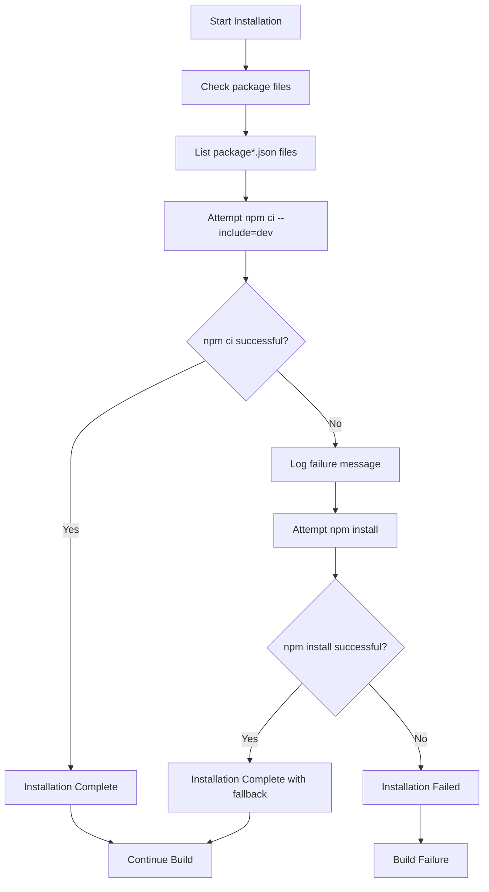

# Dependency Installation Enhancement

## Overview

The CI/CD pipeline has been enhanced with a more resilient dependency installation process that provides better reliability and debugging capabilities.

## Changes Made

### Enhanced NPM Installation Strategy

**Before (single attempt)**:
```yaml
- npm ci --include=dev
```

**After (fallback strategy)**:
```yaml
- echo "Checking for package-lock.json..."
- ls -la package*.json
- echo "Attempting npm ci..."
- npm ci --include=dev || (echo "npm ci failed, trying npm install..." && npm install)
```

## Benefits

### 1. Improved Build Reliability
- **Primary Method**: Uses `npm ci --include=dev` for fast, reliable installs from package-lock.json
- **Automatic Fallback**: Seamlessly falls back to `npm install` if npm ci fails
- **No Manual Intervention**: Handles installation failures automatically without stopping the build

### 2. Better Debugging Capabilities
- **Package Verification**: Lists package files before installation to help diagnose issues
- **Clear Logging**: Shows exactly which installation method was attempted and succeeded
- **Error Context**: Provides context when npm ci fails and fallback is triggered

### 3. Handles Edge Cases
- **Corrupted Lock Files**: Automatically handles cases where package-lock.json might be corrupted
- **Missing Lock Files**: Falls back gracefully when package-lock.json is missing
- **Permission Issues**: Handles npm ci permission failures with npm install fallback
- **Network Issues**: Provides retry mechanism through different installation methods

## Technical Implementation

### Installation Process Flow



### Code Implementation

The enhancement is implemented in the CI/CD pipeline construct (`infrastructure/constructs/cicd-pipeline.ts`):

```typescript
commands: [
  'echo "=== INSTALL PHASE ==="',
  'echo "Installing dependencies..."',
  'echo "Checking for package-lock.json..."',
  'ls -la package*.json',
  'echo "Attempting npm ci..."',
  'npm ci --include=dev || (echo "npm ci failed, trying npm install..." && npm install)',
  'npm install -g aws-cdk@latest',
  'npm install -g typescript@latest',
  // ... other commands
],
```

## Impact Assessment

### Positive Impacts ✅

1. **Build Stability**: Eliminates build failures due to npm ci issues
2. **Development Velocity**: Developers aren't blocked by dependency installation problems
3. **Production Readiness**: Maintains preference for npm ci while providing safety net
4. **Debugging Efficiency**: Clear logging helps identify and resolve installation issues quickly
5. **Cost Optimization**: Reduces failed builds and associated compute costs

### No Negative Impacts ⚠️

- **Performance**: npm ci is still the primary method, so performance is maintained
- **Security**: Both npm ci and npm install use the same package.json and security policies
- **Consistency**: package-lock.json is still respected when available and valid

## Best Practices Applied

### 1. Fail-Safe Design
- Build continues with fallback method rather than failing completely
- Multiple installation strategies provide redundancy

### 2. Clear Communication
- Descriptive log messages explain what's happening at each step
- Success and failure states are clearly indicated

### 3. Debugging Support
- Package file listing helps diagnose missing or corrupted files
- Error messages provide context for troubleshooting

### 4. Production Optimization
- npm ci remains the primary method for speed and reliability
- Fallback only triggers when necessary

## Monitoring and Observability

### Build Logs
The enhanced installation process provides detailed logging:

```
=== INSTALL PHASE ===
Installing dependencies...
Checking for package-lock.json...
-rw-r--r-- 1 root root 123456 Jan 01 12:00 package-lock.json
-rw-r--r-- 1 root root   2345 Jan 01 12:00 package.json
Attempting npm ci...
npm ci --include=dev succeeded
```

Or in case of fallback:

```
=== INSTALL PHASE ===
Installing dependencies...
Checking for package-lock.json...
-rw-r--r-- 1 root root 123456 Jan 01 12:00 package-lock.json
-rw-r--r-- 1 root root   2345 Jan 01 12:00 package.json
Attempting npm ci...
npm ci failed, trying npm install...
npm install succeeded
```

### CloudWatch Metrics
- Build success/failure rates can be monitored
- Installation method usage can be tracked through log analysis
- Build duration impact can be measured

## Future Enhancements

### Potential Improvements
1. **Metrics Collection**: Track which installation method is used most frequently
2. **Cache Optimization**: Implement npm cache strategies for faster installs
3. **Dependency Validation**: Add dependency security scanning
4. **Performance Monitoring**: Track installation times for optimization

### Maintenance Considerations
1. **Regular Updates**: Keep npm and Node.js versions updated
2. **Lock File Management**: Ensure package-lock.json is properly maintained
3. **Dependency Auditing**: Regular security audits of dependencies
4. **Build Time Optimization**: Monitor and optimize installation performance

## Conclusion

This enhancement significantly improves the reliability and maintainability of the CI/CD pipeline's dependency installation process. By providing automatic fallback mechanisms and better debugging information, it ensures that builds can proceed successfully even when encountering common npm installation issues.

The implementation follows best practices for resilient build systems while maintaining the performance benefits of npm ci for normal operations.

## Related Documentation

- [BUILDSPEC_UPDATE_SUMMARY.md](BUILDSPEC_UPDATE_SUMMARY.md) - Complete buildspec.yml change history
- [CICD_DEPLOYMENT.md](CICD_DEPLOYMENT.md) - Full CI/CD pipeline documentation
- [DEPLOYMENT.md](DEPLOYMENT.md) - General deployment guide with pipeline information
- [BUILD_FIX_SUMMARY.md](BUILD_FIX_SUMMARY.md) - Build stability improvements

**Last Updated**: Enhanced dependency installation with fallback strategy implemented and documented.